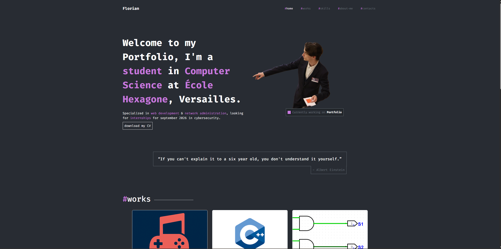
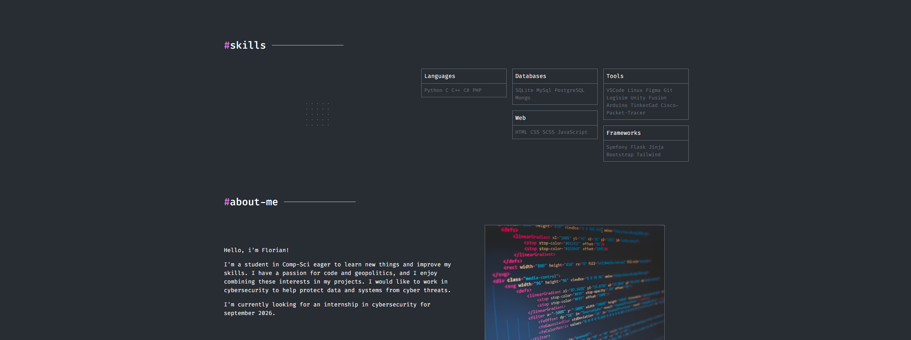
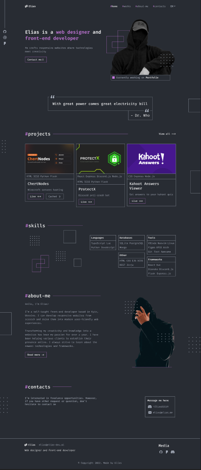

#  Personal Portfolio - Florian Lechevallier

Welcome to my personal portfolio repository. This project showcases my skills, school projects, and experience as a Computer Science student at **École Hexagone**.

##  Author
**Florian Lechevallier** *Computer Science Student | Web Development & Cybersecurity Enthusiast*

---

##  Portfolio Preview
Here is a look at the final website:




*(Note: If the image above does not load, please check the `img` folder).*

---

## Design & Mockup (Figma)
Before coding, this project was designed using a template Figma.

**  [Click here to view the Figma Prototype](https://www.figma.com/design/itpwNqcQvsQun07dsWb1EK/Portfolio--Community-?node-id=0-1&p=f&t=o6YWPi7qmsHOMWga-0)**

### Mockup Screenshot:


---

## Languages & Technologies Used
This project was built using the following technologies:

### Core:
* **HTML5** (Semantic structure)
* **CSS3** (Custom styling & responsive design)
* **JavaScript** (Navbar logic & interactivity)

### Frameworks & Libraries:
* **Bootstrap 5** (Grid system, Navbar, Responsive utilities)
* **FontAwesome** (Icons)

### Tools:
* **VS Code**
* **Git & GitHub**
* **Figma**

---

## How to Run the Project Locally

Follow these steps to view the portfolio on your local machine:

1.  **Clone the repository:**
    ```bash
    git clone [https://github.com/GrumpyGreyCat/portfolio.git](https://github.com/GrumpyGreyCat/portfolio.git)
    ```

2.  **Navigate to the project folder:**
    ```bash
    cd portfolio
    ```

3.  **Open the website:**
    * Simply double-click `index.html` to open it in your default browser.
    * OR, if you use VS Code, right-click `index.html` and select **"Open with Live Server"**.

---

## Contact Me

Feel free to reach out to me for internships or collaborations!

* **Email:** [Florian.lechevallier@ecole-hexagone.com](mailto:Florian.lechevallier@ecole-hexagone.com)
* **LinkedIn:** [Florian Lechevallier](https://www.linkedin.com/in/florian-lechevallier-a19654295)
* **GitHub:** [GrumpyGreyCat](https://github.com/GrumpyGreyCat)

---
© 2025 Florian Lechevallier. All Rights Reserved.
